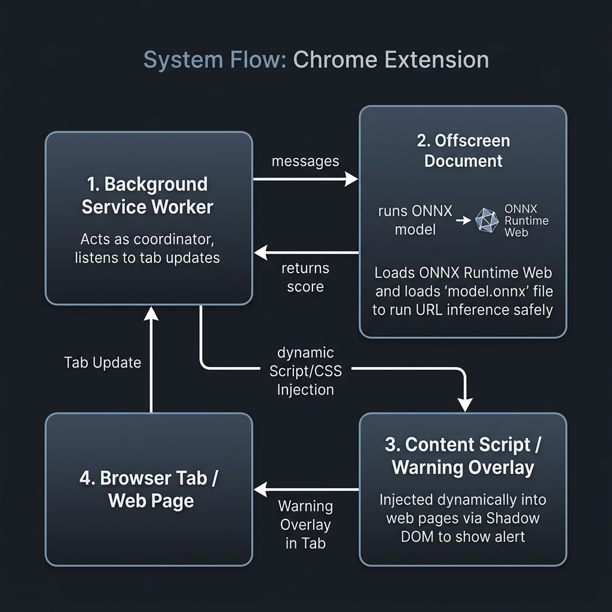

# 🛡️ Local Phishing URL Detector (Browser Extension)

[](https://github.com/)
[](https://developer.chrome.com/docs/extensions/mv3/)
[](https://onnxruntime.ai/)
[](https://opensource.org/licenses/MIT)

A privacy-focused, real-time phishing URL detection browser extension built using **Manifest V3**. This extension evaluates the safety of your current browsing tab completely **on-device** using a compiled Machine Learning model—no URLs are ever sent to an external server.

It leverages the **ONNX Runtime Web** engine to run inference on the [`pirocheto/phishing-url-detection`](https://huggingface.co/pirocheto/phishing-url-detection) model directly within a secure sandboxed offscreen document.

---

## ✨ Features

*   **🔒 100% Private & Local:** URL analysis happens entirely inside your browser using WebAssembly (WASM).
*   **⚡ Real-Time Scanning:** Automatically checks loaded tabs and alerts you immediately if phishing is detected.
*   **🚨 Smart Warning Overlay:** Displays a gorgeous glassmorphic warning modal on pages with a phishing score >75%, letting you go back to safety instantly.
*   **🎨 Popup Utility:** Check the score manually anytime by clicking the extension action popup.
*   **🚀 Manifest V3 Compliant:** Built using modern, secure Chromium offscreen standards.

---

## 🛠️ System Architecture

The system utilizes an **Offscreen Document** context to execute ONNX models safely on local CPU threads, coordinating with a service worker to trigger dynamic page blocks.

### Data Flow & Architecture Diagram



```mermaid
flowchart TD
    subgraph Browser Tab Context
        User([User Navigation]) -->|onUpdated complete| SW[background.js Service Worker]
        SW -->|Inject warning.css & warning.js| Tab[Active Tab DOM]
    end

    subgraph Offscreen Document (Full HTML DOM)
        SW -->|chrome.runtime.sendMessage| Offscreen[offscreen.js Runner]
        Offscreen -->|Load Model & Inference| Model[(model.onnx)]
        Offscreen -->|Return phishing probability| SW
    end

    subgraph Injected Warning Overlay
        Tab -->|Shadow DOM Isolation| Overlay[warning.js Warning UI]
        Overlay -->|Button: Go Back| SW
        Overlay -->|Button: Proceed| Unblock[Remove Shadow Host]
    end
```

---

## 📂 Project Structure

| File / Folder | Description |
| :--- | :--- |
| `manifest.json` | Extension metadata, CSP permissions, background worker, and offscreen parameters. |
| `background.js` | Service worker managing tabs, offscreen lifecycle, and script injection. |
| `offscreen.html` | Hidden document hosting the DOM sandbox environment. |
| `offscreen.js` | Runs ONNX Runtime Web and handles model inference on-device. |
| `popup.html` / `popup.js` | Action popup layout and logic for manual URL evaluation. |
| `warning.js` / `warning.css` | Content overlay injected into tab DOM, wrapped in a Shadow DOM for styling safety. |
| `model.onnx` | Local machine learning weights for classifying phishing URLs. |
| `ort.min.js` | Minified ONNX Runtime Web engine. |
| `ort-wasm-*.wasm` / `mjs` | Multi-threaded and single-threaded WASM companion engines. |

---

## 🚀 Setup and Installation

<details>
<summary><b>Step 1: Clone the Repository</b> (Click to expand)</summary>

```bash
git clone https://github.com/YOUR_USERNAME/YOUR_REPO_NAME.git
cd YOUR_REPO_NAME
```
</details>

<details>
<summary><b>Step 2: Download Model & WebAssembly Drivers</b> (Click to expand)</summary>

Ensure the following binary files are placed directly into the root folder (if not already bundled):
*   **The Model:** Download `model.onnx` from the Hugging Face repository.
*   **ONNX Web Drivers:** The local WASM engines (`*.wasm` and `*.mjs`) must match your `ort.min.js` distribution version to satisfy Content Security Policy (CSP) rules.
</details>

<details>
<summary><b>Step 3: Load the Extension into your Browser</b> (Click to expand)</summary>

Compatible with Chrome, Brave, Edge, Opera, and other Chromium-based browsers:
1. Open your browser and navigate to `chrome://extensions/` (or `edge://extensions/`).
2. Enable **Developer mode** using the toggle switch in the top-right corner.
3. Click the **Load unpacked** button in the top-left corner.
4. Select the project root folder containing `manifest.json`.
5. Pin the **Local Phishing URL Detector** icon to your toolbar!
</details>

---

## 🔒 Privacy & Permissions

This extension requests minimal permissions to guarantee user data security:

> [!NOTE]
> *   `activeTab` / `tabs`: Used only to query the active tab's URL to perform local inference.
> *   `scripting`: Required to inject the warning screen dynamically when phishing is detected.
> *   `offscreen`: Required to create the hidden sandboxed page for WebAssembly compatibility.
> *   `host_permissions` (`<all_urls>`): Needed to dynamically query and block suspected phishing targets on any web page.

---

## 🤝 Acknowledgments

*   Model training and weights provided by **pirocheto** on Hugging Face.
*   Inference engine powered by Microsoft's **ONNX Runtime Web**.
